# Pamp

> **Pamp** is an Attack Surface Intelligence Platform designed for security researchers and penetration testers. It combines infrastructure reconnaissance, application mapping, JavaScript intelligence, and interactive offline reporting into a single workflow.

---

## Features

- IP Intelligence
- Domain Intelligence
- DNS / RDAP / TLS Analysis
- HTTP Security Analysis
- Application Blueprint
- Application Route Intelligence
- JavaScript Intelligence
- Technology Fingerprinting
- Nmap Integration
- Public Mentions Search
- Interactive Offline HTML Reports
- English / Russian Localization

---

## Technology Stack

- Python 3.11+
- Rich
- Requests
- Playwright
- BeautifulSoup4
- Jinja2
- NetworkX
- PyVis
- Cryptography

---

## Installation

```bash
python -m venv .venv
.\.venv\Scripts\Activate.ps1

pip install -r requirements.txt
python -m playwright install chromium
```

---

## Usage

Run Pamp:

```bash
python -m pamp.main
```

or

```bash
python pamp/main.py
```

---

## Available Modules

### IP Intelligence

Analyze an IP address and collect:

- Geolocation
- ASN Information
- Reverse DNS
- Hosting Information
- Infrastructure Details

---

### Domain Intelligence

Comprehensive domain reconnaissance including:

- DNS Records
- RDAP / WHOIS
- Certificate Transparency
- TLS Certificate Analysis
- HTTP Fingerprinting
- Security Headers
- HTML Analysis
- Technology Detection
- Tracker Detection
- Public Resources
- Historical Intelligence
- Reputation Intelligence

---

### Application Intelligence

Automatically discovers:

- Application Blueprint
- Route Structure
- JavaScript Assets
- API Endpoints
- OAuth Endpoints
- WebSocket Connections
- Cloud Storage References

---

### Reports

Pamp generates a fully interactive offline HTML report featuring:

- Search
- Filtering
- Sidebar Navigation
- Timeline
- Interactive Graphs
- Attack Surface Summary
- English / Russian Localization

---

## Public Data Sources

Pamp relies only on publicly available sources.

Examples include:

- RDAP
- crt.sh
- Cloudflare DNS
- Internet Archive
- AlienVault OTX
- OpenPhish
- PhishTank
- URLHaus
- ThreatFox

No paid APIs are required.

---

## Screenshots

### Menu

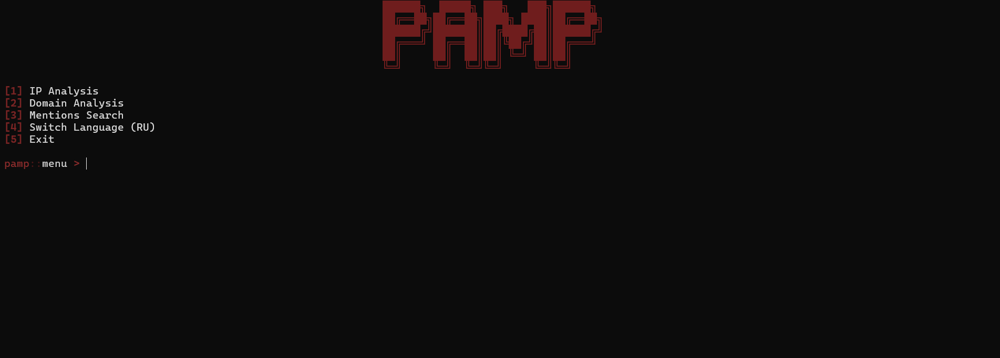

Main CLI interface with available analysis modules, language selection, and quick access to the current workspace.

---

### Search

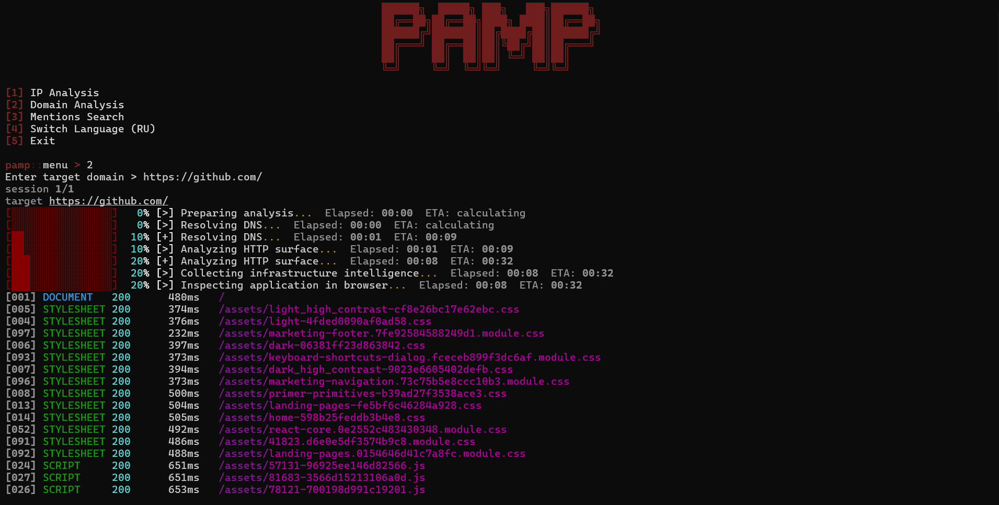

Target initialization and reconnaissance workflow for a new analysis session.

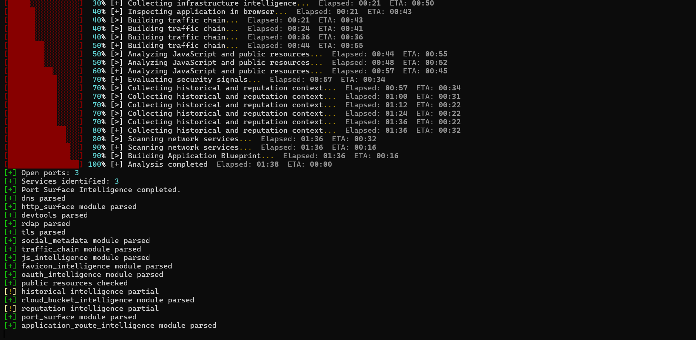

Live progress view showing module execution and real-time analysis status.

---

### Analysis Complete

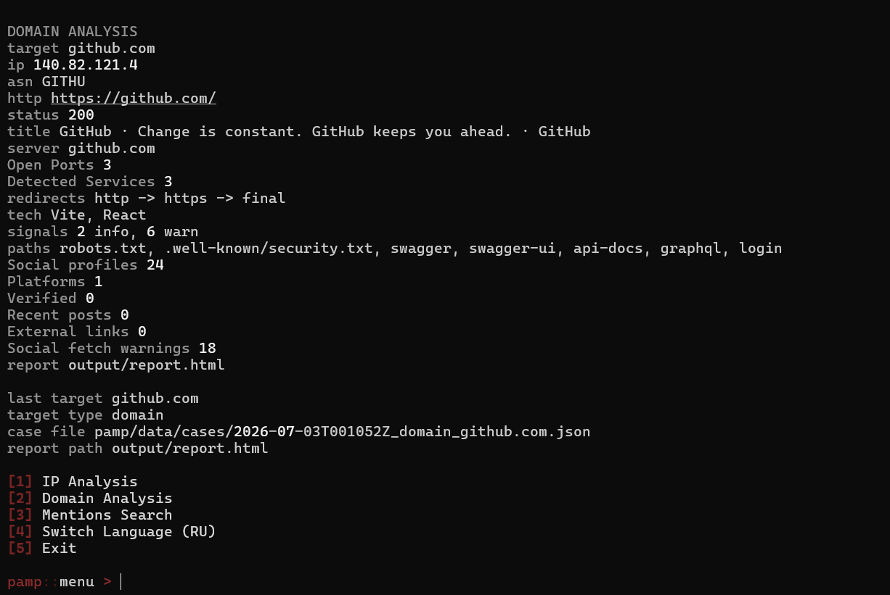

Completed analysis with generated artifacts, statistics, and an interactive HTML report ready for review.

---

### HTML Report

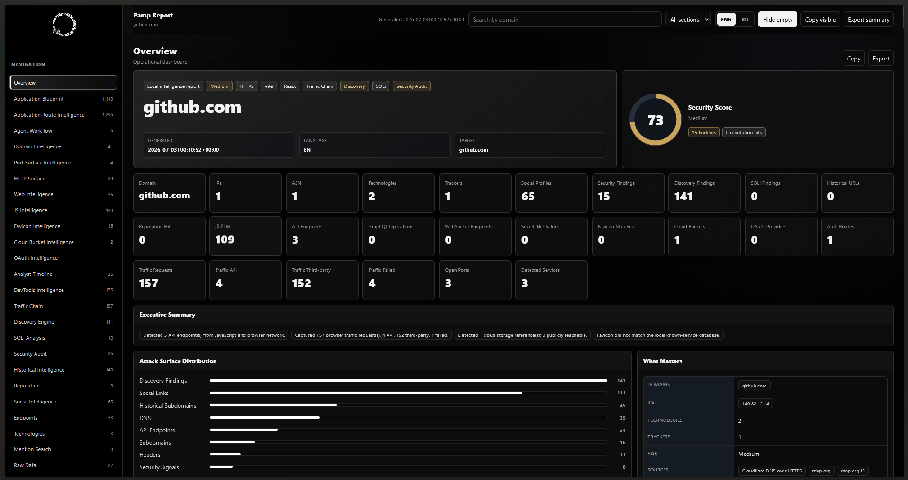

Interactive offline HTML report with navigation, filtering, search, visual analytics, and detailed findings.

---

### Application Blueprint

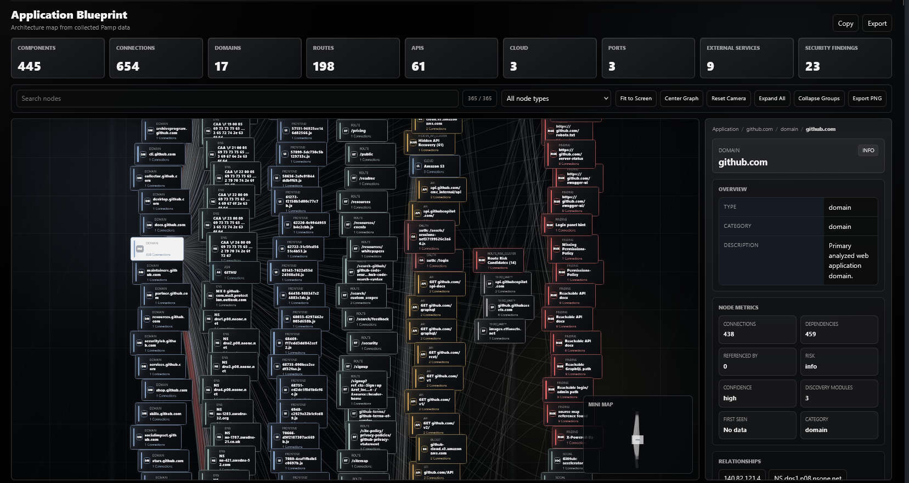

Interactive application graph that visualizes discovered pages, APIs, technologies, relationships, and attack surface components.

---

### Infrastructure Blueprint

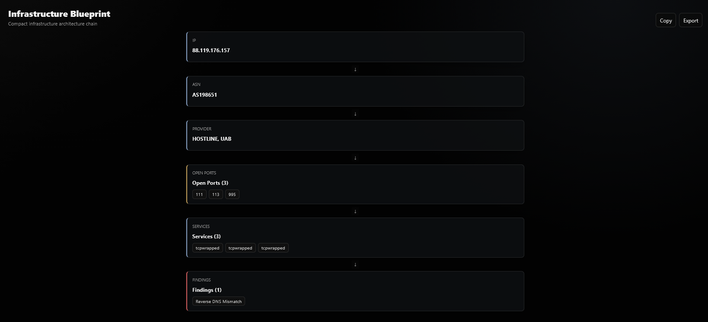

Infrastructure visualization connecting domains, IP addresses, services, ports, certificates, and network relationships.

---

### HTTP Surface

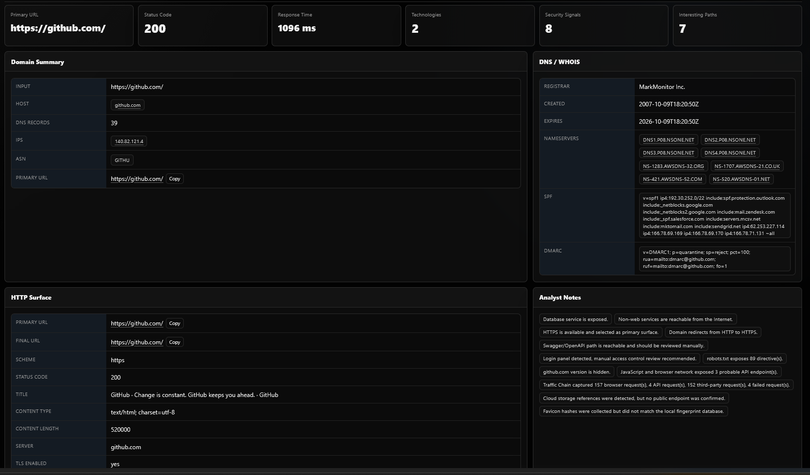

HTTP reconnaissance including response headers, security headers, technologies, redirects, and response metadata.

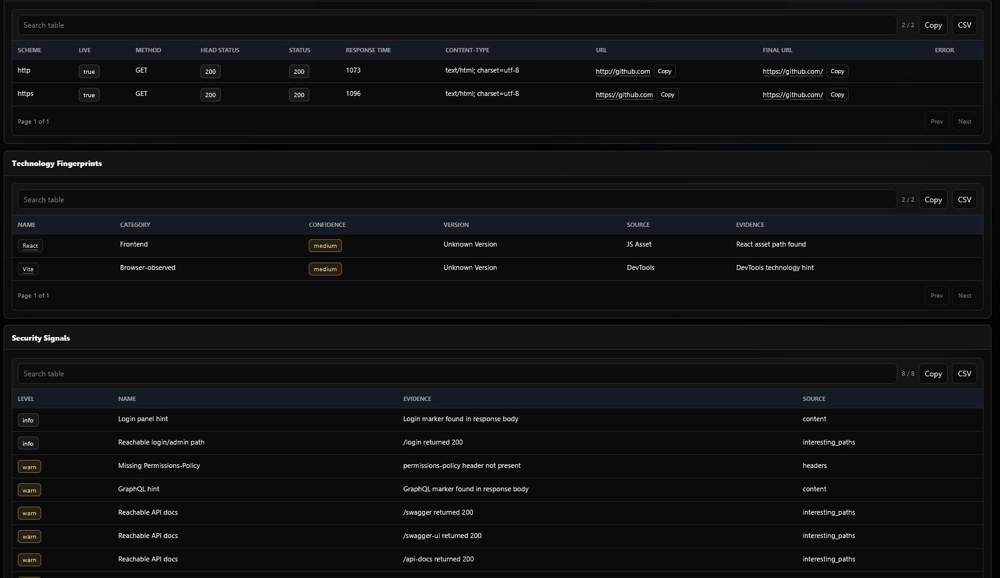

Detailed HTTP intelligence with endpoint grouping and response classification.

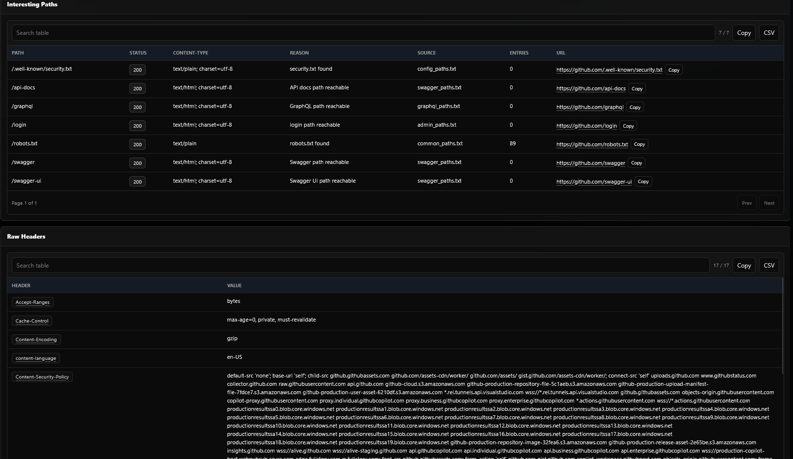

Expanded HTTP analysis highlighting additional application characteristics and security observations.

---

### Endpoint Intelligence

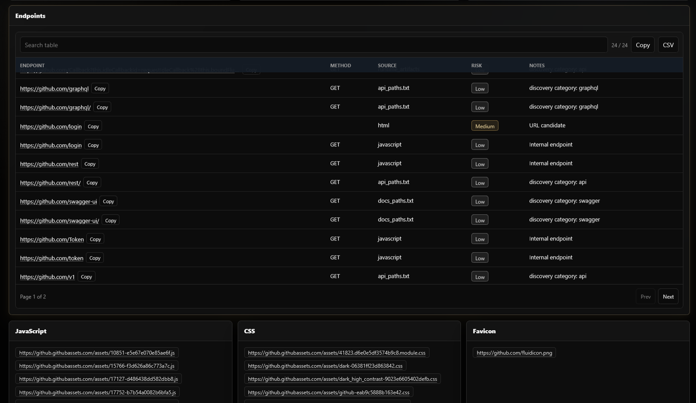

Discovered application endpoints collected from HTML, JavaScript, browser traffic, and application assets.

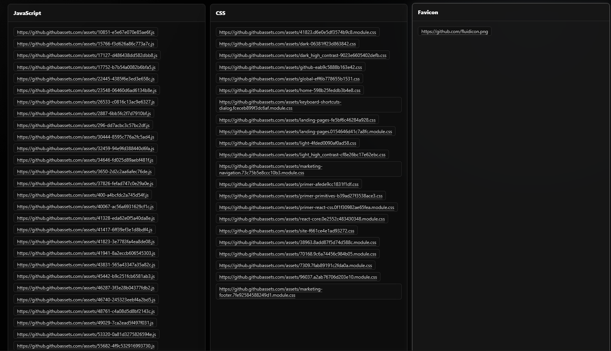

Extended endpoint analysis with categorized routes and additional discovered resources.

---

### IP Intelligence

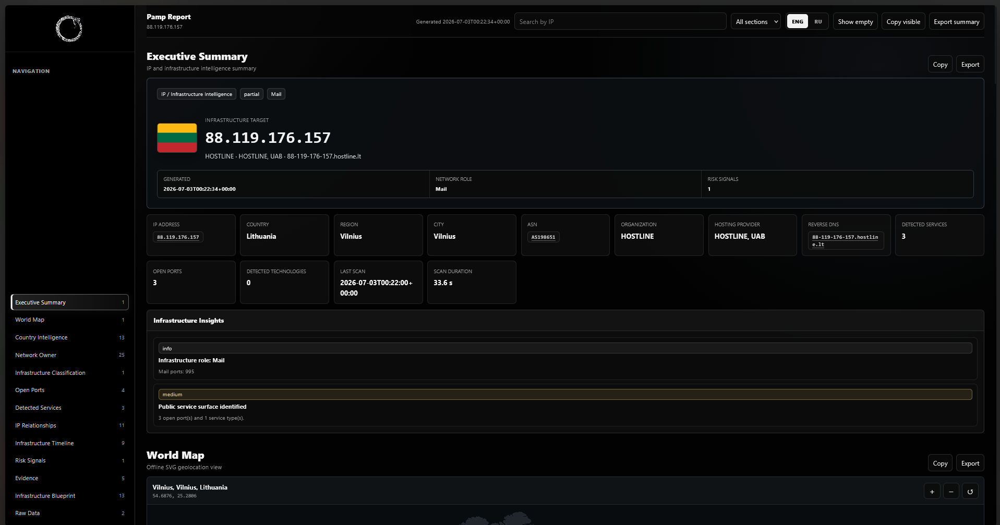

Comprehensive IP intelligence including ASN, hosting provider, geolocation, network ownership, and infrastructure details.

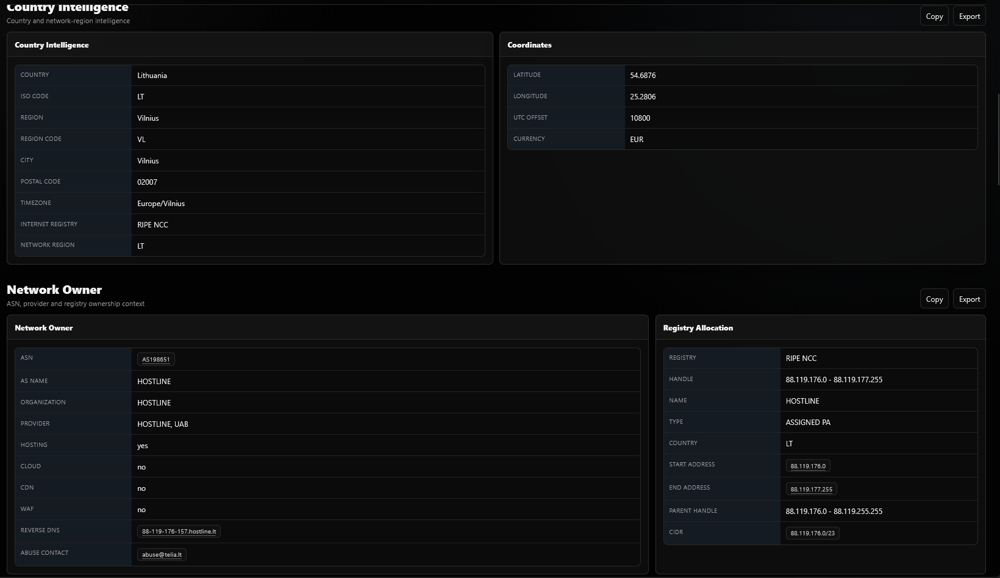

Additional IP intelligence with extended infrastructure and security information.

---

### IP Relationships

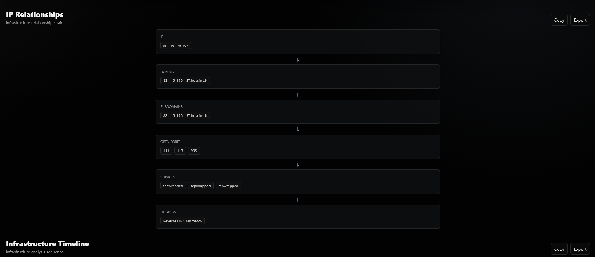

Relationship graph connecting IP addresses with domains, services, technologies, certificates, and security findings.

---

### World Map

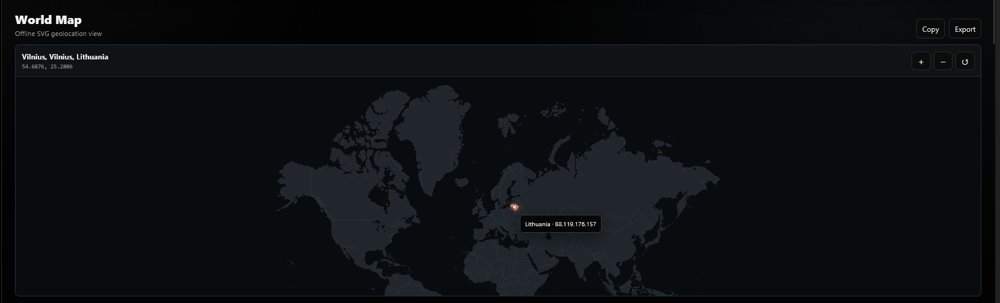

Offline geographic visualization showing the approximate location of analyzed infrastructure.

---

### Visual Chain Summary

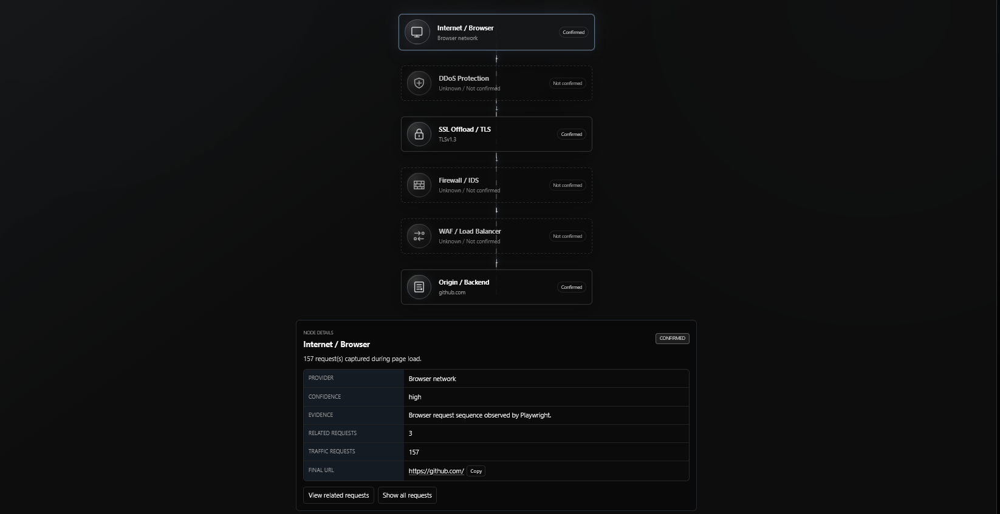

Traffic chain overview illustrating how requests travel through the application infrastructure from client to origin.

## Security

Pamp:

- does not require API keys
- does not require `.env`
- masks sensitive values in reports
- does not brute-force endpoints
- does not attempt to crack or decrypt secrets

---

## Disclaimer

Pamp is intended for authorized security testing, research, and educational purposes only.

Use this software only against systems you own or have explicit permission to assess.
